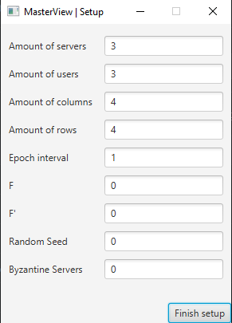

# Highly Dependable Location Tracker - Stage 1

## Environment & Technologies

The project was developed in [Kotlin](https://kotlinlang.org) and uses [Gradle](https://gradle.com) as a build tool to
facilitate development as well as testing. We recommend opening the entire project in [IntelliJ](https://www.jetbrains.com/idea/) as it comes with gradle
and kotlin installed. It is a lot easier to work within this IDE. It integrates fairly well with both of these
technologies.

## Modules Structure

The project is divided in 5 different modules:

- **HDLT-CA** - An helper to generate all the certificates and private keys
- **HDLT-MasterServer** - The client that helps visualize the user grid, as well as control the epochs broadcasts. It
  aids in setting up the entire system
- **HDLT-LocationServer** - The server that handles all the users' connections as well as persist the epochs' data.
- **HDLT-User** - The user can request proofs from other users and submit the reports (with proofs) to the server. They
  can also query their own submitted reports.
- **HDLT-HA** - The HA can query all the reports from all users on the server

## GRPC - Protos

The communication is done using GRPC. The proto files are inside the `protos` module. They can be compiled using
the `generateProto` gradle task from the same module.

## Server - Database

To persist data in the server, we decided to use a simple SQLite database. It stores the user reports and their proofs.
There is also a set of tables for the nonces (to ensure freshness). To create the database and run the migrations, you
can use the `migrateDb` gradle task.

## Running everything

To run the system, you first start the LocationServer followed by the MasterServer. When the MasterServer launches, you
will see a window that will help to set up the system. Here you can select the amount of users, grid size (columns and
rows), f and f' parameters. To run each of these modules, use the following commands:

```bash
gradlew HDLT-LocationServer:run
gradlew HDLT-MasterServer:run
```

After setting up the master, you need to fire up the users. There should be as many users as you defined in the master.
To run a user use the following command:

```bash
gradlew HDLT-User:run --args="<id> <serverAddress> <port> <byzantineLevel>"
```

The id should be incremental for each user and should start at 0. The serverAddress should be `localhost` in most cases.
The port of the server is hardcoded as `7777` for now. Byzantine level defines if the user will be attempting to be
byzantine or not (-1 for always correct, 6 for hardest level).

Byzantine levels:

0. Forge reports with _self-signed_ proofs
1. Skip epoch communication
2. Tamper some fields in requests
3. Reject another user's requests
4. Redirect requests to other users
5. No information verification

_**NOTE:** -1 for no byzantine_

_**NOTE:** The users' ports start at 8100, and the id is used to get a unique port per user: 8100+id. This is why the id
needs to be incremental and start at 0_

The master will define the byzantine users as the last f users. This means that if you wish to have byzantine users,
make sure their id starts from userCount - f.

To run the HA you can execute the following command:

```bash
gradlew HDLT-HA:run --args="<serverAddress> <port>"
```

If you wish to create new certificates, you can use the `generate` script with the CA. The command to run is:

```bash
gradlew HDLT-HA:run < generate
```

If you want to change the values, you can run the command without the script.

## Full example

We will be using 1 LocationServer, 1 MasterServer, 4 Users and 1 HA for this example. The grid will be 5 rows by 5
columns, and we will have a maximum of 2 byzantine users. You will need 7 different terminal windows to run this setup.

Let us start by firing up the LocationServer in terminal 1.

```bash
gradlew HDLT-LocationServer:run
```

Then we can start the MasterServer in terminal 2:

```bash
gradlew HDLT-MasterServer:run
```

The setup window should be populated to look like this:


You can press `Finish Setup` but don't start just yet!

Now we need to start all the users. We're going to be using 2 byzantine users, so those are going to be the last ones we
initialize. Each user will have its own terminal, and the series of commands will be the following:

```bash
gradlew HDLT-User:run --args="0 localhost 7777 -1"
gradlew HDLT-User:run --args="1 localhost 7777 -1"
gradlew HDLT-User:run --args="2 localhost 7777 1"
gradlew HDLT-User:run --args="3 localhost 7777 2"
```

This means user 2 and 3 will be byzantine and can have incorrect behaviour.

Finally, we can start the HA:

```bash
gradlew HDLT-HA:run --args="localhost 7777"
```

When all of this is set up, we can press `Start` on the Master window and see the users move. Their terminals will also
log the requests being received and sent. At any point, a user can request the server for proofs of a specific epoch.
One can do this by just typing the desired epoch in the user prompt. If the user happens to be byzantine, he can try to
fetch the reports of another user by specifying the other user's id after the epoch.

```bash
// Normal execution - User 0 request report for epoch 5
5
// Byzantine execution - User 3 request report for epoch 5 for user 0
5 0
```
